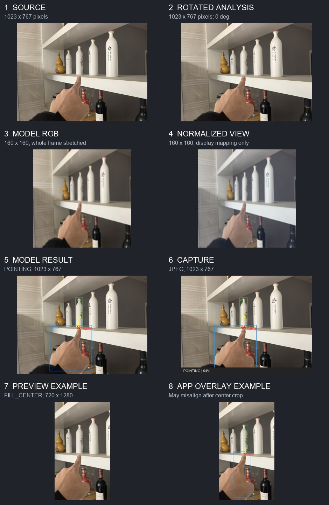

# See the image change, step by step

**This page illustrates the earlier cropped preview.** For the corrected Android app, open [README_FIXED.md](README_FIXED.md) and [the full-frame visual](fixed_output/00_fixed_flow.jpg).

Open **[the eight-panel visual walkthrough](output/00_all_steps.jpg)** first. Read left to right, then down. It uses your [test image](../ROI_issues/test.jpg) and runs the real [`spatialnet_v4.onnx`](../ROIModel/spatialnet_v4.onnx). The files in `output/` are saved at their **actual stage dimensions**; the contact sheet scales them down only to fit on one page.



The supplied `test.jpg` is **1023 x 767 pixels**. It is a still image, so the script uses **0 degrees rotation** by default. That is why stages 1 and 2 look identical. On the phone, CameraX supplies an `ImageProxy` and a rotation value; a 90- or 270-degree rotation would swap its width and height. To see that case, run the script with `--rotation 90`.

The app copies the whole rotated analysis frame for a future Capture, then makes a second, much smaller image for the model. Here that means **1023 x 767 -> 160 x 160**. The full rectangle is squeezed into the square: nothing is cut off or padded. [Stage 3](output/03_model_rgb_160x160.png) is the actual visible RGB model image. Its three channels are divided by 255 and normalized with ImageNet mean and standard deviation. This makes a **float32 `[1, 3, 160, 160]` tensor**, saved in [04_actual_model_tensor.npy](output/04_actual_model_tensor.npy). Floats after normalization are not an ordinary viewable photo. [Stage 4](output/04_normalized_visual_only.png) remaps those floats to display colors **only as a visual aid**; that PNG is not what ONNX Runtime receives.

SpatialNet returns numbers, not a new image. The complete seven outputs and the three sigmoid probabilities are in [05_model_output.json](output/05_model_output.json). For this run, the model found `POINTING`: hand **99.6%**, pointing **98.8%**, ROI **93.8%**. The fingertip is `(0.473684, 0.526316)` in normalized coordinates. Multiplying by the original dimensions places it at about **(485, 404) pixels** on the 1023 x 767 frame. A box uses `(center_x +/- width/2) x frame_width` and `(center_y +/- height/2) x frame_height`. [Stage 5](output/06_prediction_on_analysis.png) draws the resulting hand box, target box, fingertip, and pointing arrow on the full-sized frame. The 160 x 160 image is **not enlarged as a photo**; only its normalized *coordinates* are scaled to the larger canvas.

The app's Capture button takes that cached **rotated analysis bitmap**, draws the result on it, adds a bottom status bar, and saves a JPEG. [Stage 6](output/07_capture_simulation.jpg) simulates this on `test.jpg`; it is **1023 x 767**, the same dimensions as stage 2. Capture is not a screenshot of the phone UI. The script uses the single image's raw prediction, while the running app uses a five-frame smoothing window for overlay mode and can pair the latest result with a slightly different cached frame.

The live preview follows a **separate CameraX stream**. Its pixel resolution is not fixed by this app. `PreviewView` fills the available screen area using `FILL_CENTER`, which preserves aspect ratio and crops the sides or top/bottom. [Stage 7](output/08_fill_center_preview_example.png) shows how this landscape image would be center-cropped into an **illustrative 720 x 1280 preview area**. The app puts its overlay on a separate canvas covering that area and multiplies normalized coordinates by the full canvas width and height. [Stage 8](output/09_app_overlay_on_preview_example.png) shows that mapping. The box can be visibly offset from the object because the preview was cropped but the overlay coordinates were not adjusted for that crop. The real Preview stream may also have a different size from the analysis frame, so these two preview stages illustrate the geometry rather than reproduce a particular phone frame exactly.

Your [actual phone screenshot and saved capture comparison](output/10_actual_phone_examples.jpg) shows another important size difference: the screenshot file is **576 x 1280** including app UI, while the app's saved capture file is **480 x 640**. The latter comes from the analysis frame; it is not a downscaled copy of the former. The screenshot includes status and app bars, so **576 x 1280 is not the camera canvas size**. The two files also cannot prove the exact Preview stream resolution.

## Files to open in order

| File | Dimensions | What you are seeing |
| --- | --- | --- |
| [01_source.png](output/01_source.png) | 1023 x 767 | Supplied still image, standing in for a camera frame |
| [02_rotated_analysis.png](output/02_rotated_analysis.png) | 1023 x 767 here | Full bitmap after requested rotation |
| [03_model_rgb_160x160.png](output/03_model_rgb_160x160.png) | 160 x 160 | Whole frame squeezed into model size |
| [04_normalized_visual_only.png](output/04_normalized_visual_only.png) | 160 x 160 | Human-readable rendering of normalized values |
| [04_actual_model_tensor.npy](output/04_actual_model_tensor.npy) | `[1, 3, 160, 160]` | Actual float32 tensor fed to ONNX Runtime |
| [05_model_output.json](output/05_model_output.json) | Seven numeric outputs | Raw and interpreted model results |
| [06_prediction_on_analysis.png](output/06_prediction_on_analysis.png) | 1023 x 767 | Normalized predictions drawn on full frame |
| [07_capture_simulation.jpg](output/07_capture_simulation.jpg) | 1023 x 767 | Example saved JPEG with bottom status bar |
| [08_fill_center_preview_example.png](output/08_fill_center_preview_example.png) | 720 x 1280 | Example preview crop, not actual device size |
| [09_app_overlay_on_preview_example.png](output/09_app_overlay_on_preview_example.png) | 720 x 1280 | Example of the app's direct overlay mapping |
| [10_actual_phone_examples.jpg](output/10_actual_phone_examples.jpg) | Comparison panel | Your actual preview screenshot and capture |

## Regenerate with another image

From the repository root:

```powershell
python -m pip install -r image_walkthrough/requirements.txt
python image_walkthrough/make_walkthrough.py
```

For another image and a simulated 90-degree CameraX rotation:

```powershell
python image_walkthrough/make_walkthrough.py --image path/to/photo.jpg --rotation 90 --output image_walkthrough/another_run
```

`--preview-width` and `--preview-height` change only the illustrative preview canvas. The script uses Pillow bilinear resize to approximate Android's filtered `Bitmap.createScaledBitmap`; pixel values and predictions can differ slightly from a real phone. It does not pretend that a still JPEG reveals a phone's CameraX stream dimensions.
