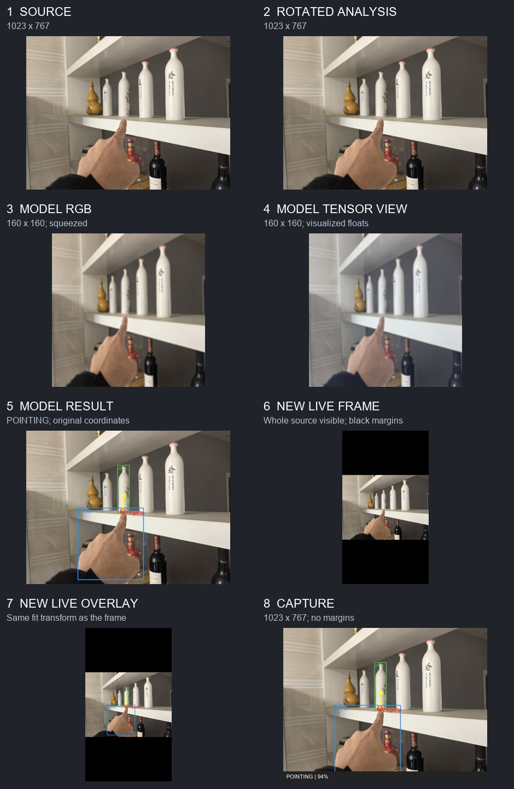

# Fixed flow: the full frame stays visible

Open [the new eight-panel visual](fixed_output/00_fixed_flow.jpg). The app now displays the **same rotated analysis frame that it sends to the model**. It fits the entire frame on screen, adds black margins when needed, and draws model coordinates inside the fitted image. Capture uses that same frame and prediction pair. There is no separate CameraX `Preview` stream or center crop.



Follow the panels from left to right, then down:

1. **Source, 1023 x 767.** Your `ROI_issues/test.jpg` stands in for one CameraX analysis frame. The real camera's frame size is chosen by CameraX and may differ.
2. **Rotated analysis, 1023 x 767 here.** The script uses 0 degrees because a still JPEG has no `ImageProxy.rotationDegrees`. On a phone, a 90- or 270-degree rotation swaps width and height. This full rotated bitmap is the source for the visible image, model preprocessing, and saved Capture.
3. **Model RGB, 160 x 160.** The complete frame is stretched into a square with filtered resize. It is not cropped or padded. The app divides RGB by 255 and normalizes each channel with ImageNet mean and standard deviation.
4. **Model tensor view, 160 x 160.** This picture is only a color mapping of the normalized floats. The actual ONNX input is float32 `[1, 3, 160, 160]`, saved in [04_actual_model_tensor.npy](output/04_actual_model_tensor.npy).
5. **Model result, 1023 x 767.** SpatialNet returns normalized boxes, fingertip, direction, and three confidence logits. The app applies sigmoid and the 0.5 gates. On this photo it reports `POINTING`. Scaling the normalized positions by 1023 and 767 places the result back on the full source frame.
6. **New live frame, illustrative 720 x 1280 canvas.** The full 1023 x 767 image is scaled uniformly to **720 x 540**, centered at **(0, 370)**. The black space above and below is part of the screen canvas, not part of the image. Nothing from the source is cut off. See [the plain fitted frame](fixed_output/07_full_frame_preview.png) and [its geometry](fixed_output/preview_geometry.json).
7. **New live overlay, same 720 x 1280 canvas.** Every normalized position is first multiplied by the displayed image width and height, then shifted by the same `(0, 370)` offset. The boxes follow the objects in the full image. See [the overlay image](fixed_output/08_aligned_overlay_preview.png).
8. **Capture, 1023 x 767.** The app copies the unscaled rotated frame, draws the boxes at that frame's coordinates, adds a bottom status bar, and saves a JPEG. The screen's black margins and buttons are not saved. See [the capture simulation](output/07_capture_simulation.jpg).

The fit calculation in the Android app is:

```text
scale = min(canvas_width / frame_width, canvas_height / frame_height)
shown_width = frame_width * scale
shown_height = frame_height * scale
left_margin = (canvas_width - shown_width) / 2
top_margin = (canvas_height - shown_height) / 2
screen_x = left_margin + normalized_x * shown_width
screen_y = top_margin + normalized_y * shown_height
```

For example, this model's fingertip is about `(0.473684, 0.526316)`. On the **1023 x 767** analysis frame that is about **(485, 404)**. On the **illustrative 720 x 1280** fitted screen it becomes approximately **(341, 654)**: `(0 + 0.473684 x 720, 370 + 0.526316 x 540)`. These positions refer to the **same fingertip** in two different coordinate spaces.

Your older phone files in `ROI_issues/` show a **576 x 1280 screenshot** and a **480 x 640 saved capture**. The screenshot includes the phone UI, so its size is not the camera canvas size. The saved capture's 480 x 640 dimensions show the analysis-frame output from that run. After installing the new APK, the live image should show the entire analysis frame with margins as needed; Capture still saves at the analysis frame's own dimensions.

The live image updates **once per processed inference frame**. This makes the frame and drawn prediction correspond to each other, but it can look less fluid than an independent camera preview on a slow phone. The result's five-frame pointing-state smoothing still affects whether the pointing overlay is shown. The script uses one photo and one prediction, so it cannot reproduce that temporal behavior.

To regenerate the images from the repository root:

```powershell
python -m pip install -r image_walkthrough/requirements.txt
python image_walkthrough/make_walkthrough.py
```

Use `--image path/to/photo.jpg --rotation 90` for another example. `--preview-width` and `--preview-height` change the illustrative screen canvas. The script uses Pillow's bilinear resize to approximate Android bitmap scaling; exact model floats may differ slightly on a phone.
